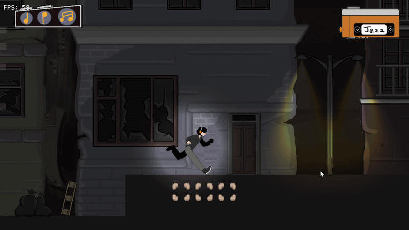
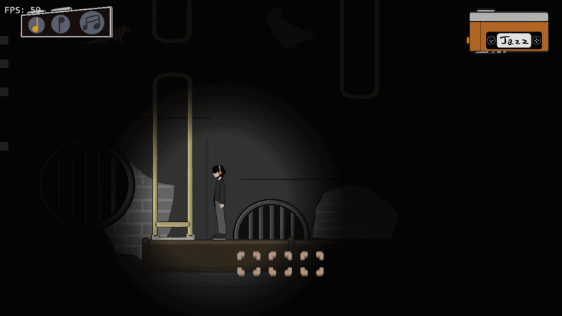
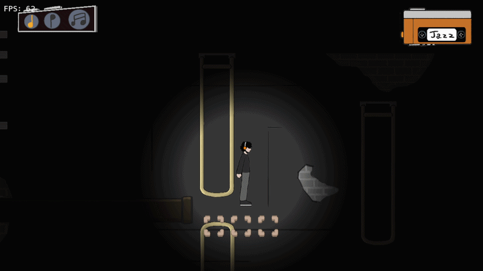
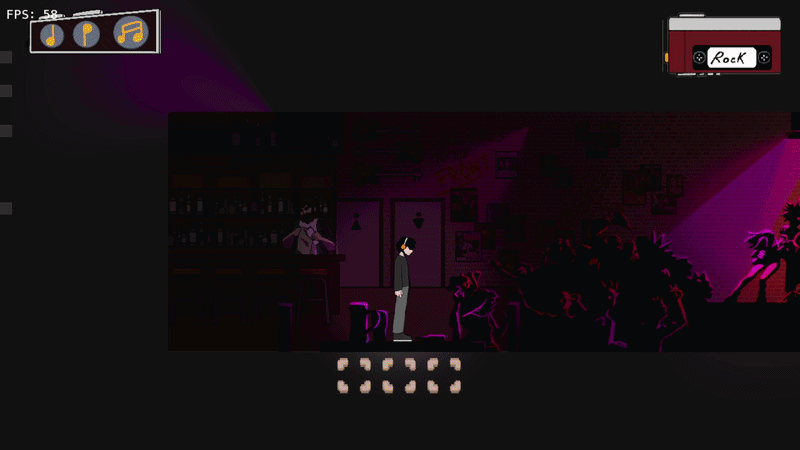
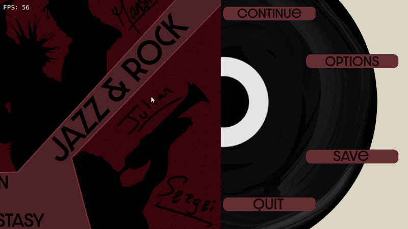
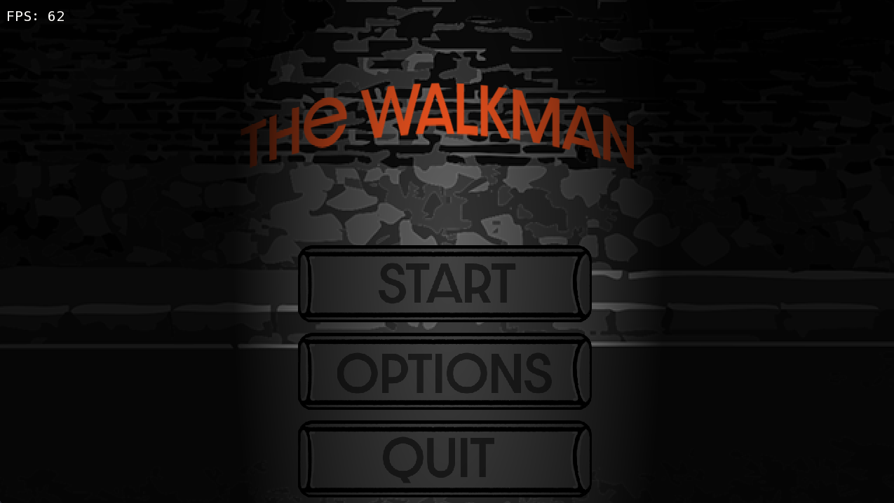

# The Walkman  (C++ - SFML)


A platformer mixed with a rythme game created in two weeks by a team of 12(including programmers, artists and buisness members) in a homemade engine. 

In a world where music is forbidden, you were to a hidden cave, to express your musicals skills and challenge Maestros. Before the fight, you must find the three parts of your guitar,  then go to the Bar and challenge a Riot Girl group in a rythme Game. You have the power to change your environements depending on which music your listening to. Use this ability to resolve enigmes and find your instrument. 

## Features:
  - Movement system : walking, running, jumping, wall jumping


  - The ability to change the environnement depending on wich music you are listening to (Jazz or Rock)




  - Boss fight : rythme game similar to like Guitar Hero


  - Different ennemies (rats and bats)
  - Lighting shaders to improve caves atmosphere
  - Menus





## Controles
  - D -> Move right
  - Q -> Move left
  - Z -> Change music
  - A -> Unload music
  - E -> interact with door
  - T -> take item


## Installation

1. Clone the repository:
   git clone https://github.com/slucasss/TheWalkman.git

2. Get the .sln for visual studio
```bash
  .\SolutionGenerator.exe -make ./
```

3. Open it in visual studio

4. Compile

6. Run MiniStudio Project
